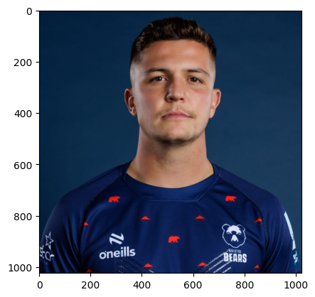
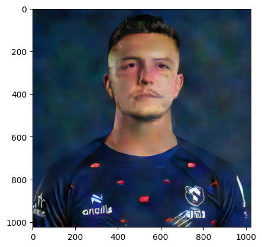
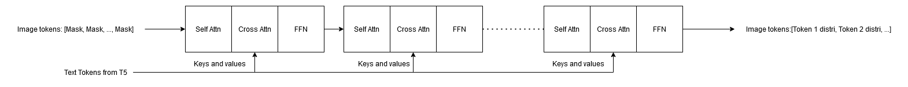
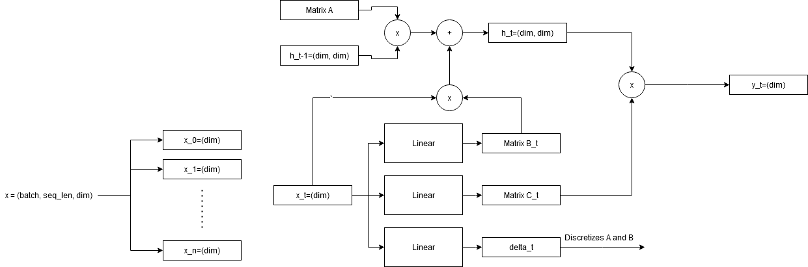

## Results table
| Method | Implemented | Trained | FID (lower is better)| Clip Score (higher is better) | Hyperparameters | Notes |
| - | - | - | - | - | - | - |
| Muse paper Results | - | - | 6.8 | 0.25 | 632M parameters, 256x256 resolution, 1.5 million training iterations at 512 batch-size, probably 24 transformer layers (my estimation) |
| Same model as in Muse paper | Yes | Yes | 92.6 | 0.192 | 24 transformer layers, batch size = 4, trained for 750.000 iterations (about 1 epoch) | Half of the time the output is reasonable (matches part of the text, but isn't very realistic); sometimes generates completely white image, or image with generic watermark, since many images in dataset are watermarked
| Similar to Muse paper, but smaller | Yes | Yes | 140 | 0.209 | 12 transformer layers, 1024 token size (compared to 2048 token size in paper). About 100 million parameters, batch size of 8; much faster training than above, currently trainig for 1.5 million iterations, which is about 4 epochs | Generates a lot of failed images (one single color and/or watermark) The images it does generate are sometimes intelligible |
| Mamba - repeat(Attention(text_input, image)) + xz | Yes | Yes | 83.94 | 0.213 | Same as smaller model above | A lot less completely white images, still some images with watermarks. Usually fairly intellible images. Visually looks a bit better than the rest |
| Mamba layer + attention layer x 12 | Yes | Yes | 120 | 0.204 | 12 blocks of Mamba layer + cross attention layer. Was trained with batch size 16 | |  
| Mamba - ignore part of output | Yes | No | - | - |
| Mamba - linear layer at output on the seq_len dimension | No | No | - | - |
| Mamba - linear layer at input on the seq_len dimension | No | No | - | - |
| Mamba - matrix $A$ dependent on text input | No | No | - | - |
| Mamba - matrix $B$ dependent on text input | No | No | - | - |
| Mamba - matrix $C$ dependent on text input | No | No | - | - |
| Mamba - matrix $D$ dependent on text input | No | No | - | - |
| Mamba - extra "skip connection" for text input | No | No | - | - |
| Mamba - parallel text and image layer - outputs summed and passed through linear | No | No | - | 

## VAE

### Rewriting - DONE
- Rewrote the VAE model code and training code
- Fixed issue with loading the EMA version of the vae model

### Training VAE - DONE
- the model is fully-convolutional
- training on low resolution images and upping the resolution until reaching $512\times 512$, which is close to the original image resolution ($640\times 480$)
- the hyperparameters that don't change between resolutions are:
  - number of channels of first convolution block in the encoder is $128$. The paper is not clear on architecture details, but the implementation I started from used $256$ channels. $128$ allows a larger batch-size
  - codebook_size is 8192, as in the paper
  - learning rate is 1e-4, as in the paper
- the hyperparameters that change between resolutions are:
  - for resolution $64\times64$, we use a batch size of $128$, and no gradient accumulation
  - for resolution $128\times128$, we use a batch size of $32$, and perform an optimizer step after $4$ batches, to mimic a batch size of $128$
  - for resolution $256\times256$, we use a batch size of $8$, and grad_accum_every=4, mimicking a batch size of $32$
  - for resolution $512\times512$, we use a batch size of $3$, and grad_accum_every=6, mimicking a batch size of $18$. This was faster than a batch size of $2$ and grad_accum_every=8
- the paper trained the vae for 1M steps, with a batch size of $256$, presumably on $512\times512$ images
- the training script trains the generator and discriminator at every step. It takes a batch `grad_accum_every` times, so the model should see about $2\cdot100000(128+32\cdot4+8\cdot4+3\cdot6)=61200000$ images
- since there's about $150000$ images in the dataset, each image is passed through the model around $400$ times
- assuming the paper followed a similar training routine, the model would see $1000000\cdot256\cdot2=512000000$ images, which means it sees each image about $3400$ times

### VAE results - IN PROGRESS
Visually, the reconstruction looks much better for larger images.

For example, the following $1024\times1024$ random image from the web:

The reconstruction looks like this:

<!-- TODO: include reconstruction results from lower resolution images, and from previous vae checkpoints -->

## Transformer
### Rewriting - DONE
- rewrote/studied the transformer code and the FID and Clip Score metrics
### Transformer Preparations - DONE
- modified the VAE training code to train a lowres and a highres transformer
- based on how fast training goes, will decide whether to go straight for a highres transformer or train a lowres one first
### Transformer Training - DOING
<!-- TODO: talk about hyperparameters once they are fixed -->

## Mamba
The transformer block looks roughly like this:

The Mamba block looks roughly like this:

In the case of the Transformer, the text tokens act as keys and values for cross attention.

In the base mamba, only one sequence input is available, so we have no choice but to concatenate the image token sequence with the text token sequence.

This poses an issue: there will be xtra tokens in the output sequence, because mamba input size is equal to the mamba output size. We can choose to:
- ignore those tokens in loss calculation
- add a linear layer at the beginning of the model
- add a linear layer at the output of the model
- pass the text tokens to the mamba layers in another manner

The first method doesn't consider some of the model outputs when updating its parameters. The second methods leaves the model without access to the text tokens in the inner layers (unlike the transformer in which all layers have access to the original tokens).

The last $2$ methods seem to be the most promising.

As far as passing tokens in some other manner goes, we can look at the matrices used in the Mamba update rule.

In Mamba, the input, which is of shape (batch, sequence length, sequence dimension) is passed through a linear layer to obtain batch x sequence length $B$ matrices and batch x sequence length $C$ matrices. Essentially each sequence element has its own $B$ and $C$ matrix. The Mamba update rule is $h'=Ah+Bx; y=Ch+D$.

The Mamba paper hypothesizes that making $A$ input-dependent wouldn't increase performance (because after discretization, $A$ becomes $\exp(\Delta A)$, and $\delta$ is already input dependent), and I intuitively believe the state $h$ should mostly focus on the image tokens. 

So as far as the matrices are concerned, we have $4$ places where we can inject text tokens.

Making the matrices that were not already input-dependent, dependent on the text tokens may lead to performance issues that will be tough to deal with because the update rule is implemented in CUDA code, which I don't currently master.

One other possibility is to simply add the text tokens (projected through a matrix $E$ that can be input-dependent) as an extra skip connexion to the output of the Mamba block.

Finally, we can use $2$ "parallel" mambas such that:
- the first layer of Mamba $A$ takes in image tokens and does the usual update
- the first layer of Mamba $B$ takes in text tokens and does the usual SSM thing
- the outputs of the $2$ layers are summed up (later edit: consider multiplication), passed through a linear projection, serving as inputs to the following layers
- alternatively we can keep Mamba $B$ text only, but combine its output with Mamba $A$ via any of the discusses manners. In this case, I think Mamba $B$ should consist of only one layer

Token critic idea:
- use a modified token critic that takes in the output of a mamba layer 
- the token critic can be a transformer-based model to be able to use the text input
- the token critic outputs probabilities that the logits generated by the mamba layer are correct
- each mamba layer should have its own token critic layer - sounds impossible to pretrain the critic layers, ~have final loss equal to sum of all critic losses + mamba loss?~ can't compute losses for each individual critic unless we consider the outputs of all mamba layers to represent (after softmax) token probabilities 
- after each mamba layer, its output is fed into the token critic
- the input of the next mamba layer is the element-wise product of the previous mamba layer's output and the token critic layer's output, which should lower the values of the incorrect logits

To summarize:
- use the basic Mamba and ignore some of its output when computing loss
- use the basic Mamba and add a linear layer at the output
- use the basic Mamba and add a linear layer at the input
- make one of the $A, B, C, D$ matrices dependent on the text input
- project the text tokens through a matrix $E$ and add them to the output of Mamba as a skip connection
- parallel mambas, one deals with text, one with images, and their outputs combined by summing/multiplication - in this case we can try reducing the size of the individual mambas
- mamba where each layers has an associated token critic layer that outputs probabilities that the logits generated by the mamba layer are correct
- |
| Mamba - mamba layer with associated token critic layer | No | No | - | - |

### Basic replacement - TO-DO
- replace the Transformer with the Mamba model
- figure out if I should use the Transformer token critic or train a separate mamba-based token critic
- for this phase, the mamba input will likely be the concatenation of the text token sequence with the image token sequence
### Separate image and text tokens - TO-DO
- must study the mamba code while the basic replacement is training
- ideas regarding how the image and text tokens should combine:
  - separate inputs for image and text tokens
  - image tokens accumulate in image state, text tokens accumulate in text state
  - output of a block is of the form $A*X+B*Y$ where $X$ and $Y$ are the states and $A, B$ are weight matrices
  - this works for the first block, but what about the rest? Could leave everything else as a typical mamba block
  - mamba blocks have some sort of a residual connection. Could add text tokens to the output of the SSM through one of these
  - have $2$ separate mambas going roughly in parallel and producing $2$ outputs after each block. Would need to somehow combine/mix those outputs 
  - https://arxiv.org/pdf/2403.15360.pdf
